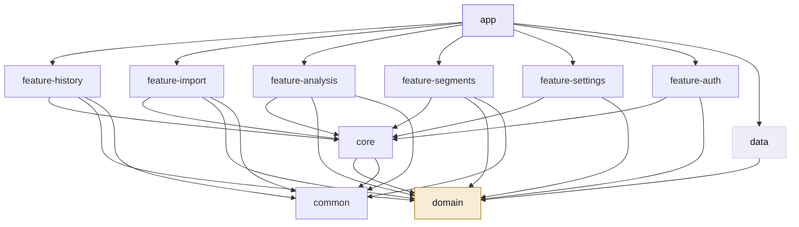
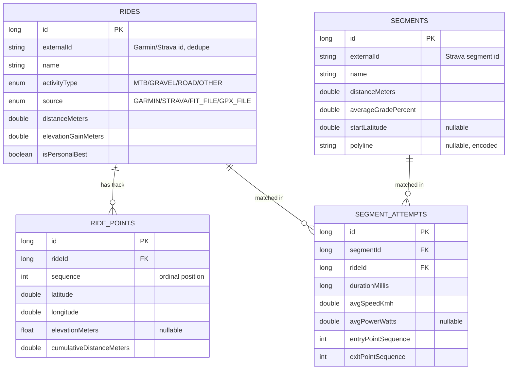
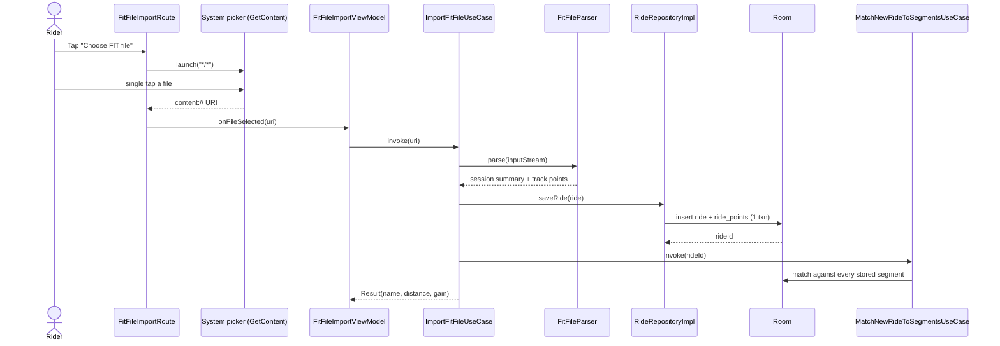
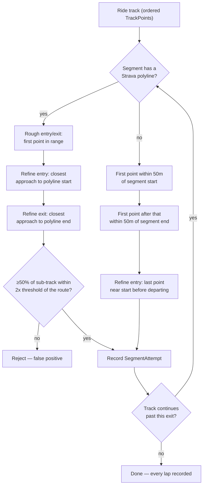
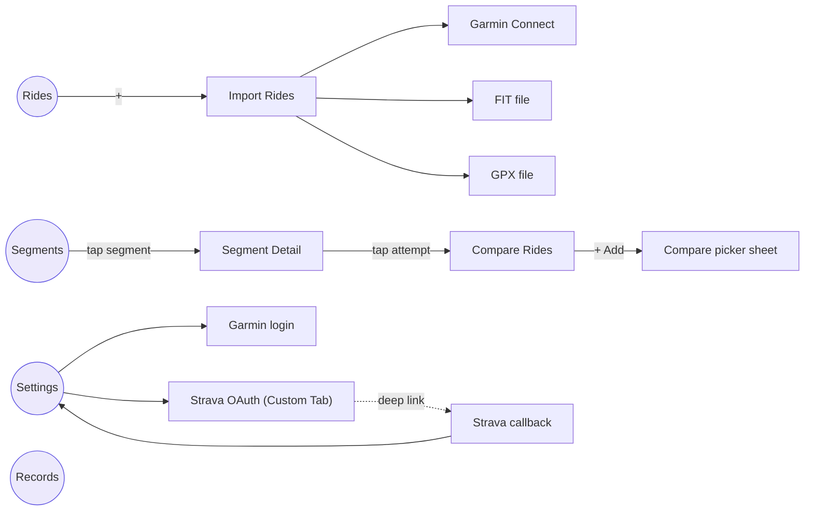

# Segment Analyzer — Architecture Reference

*How the app is built, module by module: what each part does, how a ride gets from a file or an OAuth handshake into a gradient-colored line on a map, and where the current edges of the system are.*

**Kotlin + Jetpack Compose · Clean Architecture, 11 Gradle modules · Room DB v6 · Offline-first**

---

## Contents

1. [Vision & positioning](#1-vision--positioning)
2. [Tech stack](#2-tech-stack)
3. [Module architecture](#3-module-architecture)
4. [Layering rules](#4-layering-rules)
5. [Data model](#5-data-model)
6. [Ride import](#6-ride-import--four-sources-one-contract)
7. [Segment sync](#7-segment-sync)
8. [Segment-attempt matching](#8-segment-attempt-matching)
9. [Segment Detail & Compare Rides](#9-segment-detail--compare-rides)
10. [Navigation graph](#10-navigation-graph)
11. [Known limits](#11-known-limits--stated-not-hidden)
12. [Testing & verification](#12-testing--verification)

---

## 1. Vision & positioning

Segment Analyzer doesn't record rides and doesn't do leaderboards. It sits downstream of both, explaining *why* one ride was faster or slower than another.

**Garmin Edge records the ride. Strava handles the social layer. Segment Analyzer explains the ride** — deeper split analysis, gradient-aware maps, and ride-vs-ride comparison than either of those tools surfaces on their own. Everything runs on-device: analysis stays local, and the only network calls are for import (Garmin/Strava) and map tiles.

> **Design test.** Every proposed feature is checked against one question: *does this help the rider understand why the ride was faster or slower?* If not, it doesn't belong in this app.

---

## 2. Tech stack

| Layer | Choice | Why |
|---|---|---|
| Language | Kotlin | Coroutines + Flow throughout |
| UI | Jetpack Compose, Material 3 | No XML layouts |
| Architecture | MVVM + Clean Architecture | `domain` has zero Android deps |
| DI | Hilt | Constructor injection everywhere |
| Persistence | Room (WAL mode) | Local-first, no server DB |
| Networking | OkHttp (+ Retrofit for Strava JSON) | Garmin SSO is HTML/form-based, not REST |
| Maps | MapLibre GL (OSM raster tiles) | No API key, no vendor lock-in |
| Charts | Hand-rolled Compose `Canvas` | No charting dependency yet |
| Ride parsing | Official Garmin FIT SDK + built-in `XmlPullParser` | FIT for `.fit`, XML parsing for `.gpx` |
| Testing | JUnit4 + MockK + Turbine | Flow-heavy ViewModels need Turbine |

---

## 3. Module architecture

Eleven Gradle modules, split so that business logic (`domain`) never imports an Android class, and feature modules never depend on each other directly — they only talk through `domain` interfaces, wired up in `app`'s nav graph.

| Module | Role |
|---|---|
| `app` | NavHost, DI root, splash/theme |
| `domain` | Pure Kotlin: models, repository interfaces, use cases |
| `data` | Room, OkHttp/Retrofit, repository impls |
| `core` | Shared Compose UI: theme, charts, the route map |
| `common` | Date/duration formatting helpers |
| `feature-history` | Rides tab, Records tab |
| `feature-import` | Garmin / Strava / FIT / GPX import UI |
| `feature-segments` | Segments list, Segment Detail |
| `feature-analysis` | Compare Rides |
| `feature-settings` | Account connections |
| `feature-auth` | Garmin login, Strava OAuth callback |

**Fig. 1 — Module dependency graph.** Arrows point from dependent to dependency. Feature modules never appear on both ends of an arrow.

---

## 4. Layering rules

Every feature follows the same shape: a domain `repository` interface plus a `usecase` class, an `internal class …Impl` in `data` bound via `@Binds`, and a `UiState / ViewModel / Screen / Route` quartet in the feature module.

| Layer | Depends on | Responsibility |
|---|---|---|
| `app` | everything | NavHost wires every feature's Route composables together; owns no business logic |
| `feature-*` | `core`, `domain`, `common` | Route (Hilt entry) → ViewModel (Flow-based UiState) → Screen (stateless Compose) |
| `core` / `common` | `domain` | Shared Compose components (charts, map card, theme) and formatting utilities — no business logic |
| `domain` | nothing (pure Kotlin) | Models, repository interfaces, use cases |
| `data` | `domain` (implements it) | Room entities/DAOs, OkHttp/Retrofit clients, repository implementations |

> **Convention.** ViewModels stay lightweight: they combine Flows and map to UI-ready state, but the actual matching/interpolation/formatting math lives in pure, independently-unit-tested `domain/util` functions.

---

## 5. Data model

Room database, currently at schema version 6, running in WAL mode. Four tables carry the whole app: a ride's summary, its raw GPS track, a starred segment's geometry, and the join between the two — a matched attempt.

**Fig. 2 — Entity-relationship diagram.** `RIDE_POINTS` only exists for FIT/GPX-imported rides (see §9). `SEGMENT_ATTEMPTS` is unique on `(segmentId, rideId, entryPointSequence)` so one ride can produce several rows — one per lap.

Pre-release, schema changes use `fallbackToDestructiveMigration(dropAllTables = true)` rather than hand-written `Migration` objects — a deliberate, temporary trade explicitly chosen for this stage, not an oversight.

---

## 6. Ride import — four sources, one contract

Every importer ends at the same place: a domain `Ride` (plus, for two of the four sources, a full `List<TrackPoint>`) handed to `RideRepository.saveRide()`.

| Source | Transport | Per-point track? | Elevation? |
|---|---|---|---|
| Garmin Connect | SSO login + MFA, HTML/form-based scraping | No | — |
| Strava | OAuth (segments only — ride import declined by design) | No | — |
| FIT file | Official Garmin FIT Java SDK | Yes | Device-dependent † |
| GPX file | Android's built-in `XmlPullParser` | Yes | Yes, if source has `<ele>` |

† Confirmed live: a real recorded `.fit` file can have GPS with zero elevation values — the recording device never populated `RecordMesg.altitude`. Not a parser bug; GPX is the more dependable elevation source.

**Fig. 3 — FIT import, end to end.** GPX follows the identical shape with `GpxFileParser` in place of the FIT SDK — deliberately mirrored file-for-file.

> **Fixed.** Both file pickers used to launch `ActivityResultContracts.OpenDocument()`, whose system "Downloads" grid view needed a confusing two-step tap (select, then a separate "Select" button) — read by users as "can't load files." Switched to `GetContent()`: a plain single-tap list picker, verified live.

---

## 7. Segment sync

Segments come only from Strava's starred-segments API (OAuth, official REST endpoints). A sync does two passes: the list call for name/distance/gradient stats, then one best-effort `GET /segments/{id}` per segment to backfill its full route polyline (Google's standard encoded-polyline format, decoded with a hand-rolled decoder verified against Google's own canonical example string). A failed polyline fetch just leaves that one segment on endpoint-only matching — it doesn't fail the whole sync.

---

## 8. Segment-attempt matching

The core algorithm no server can do for you: given a segment's geometry and a ride's raw track, find every point where the ride actually rode that segment — and how long it took.

**Fig. 4 — `matchAllSegmentPasses()`.** Loops from each match's exit point, so a rider lapping the same descent six times in one ride produces six attempts, not one.

| Bug found this build | Root cause | Fix |
|---|---|---|
| PR showed 4:01, real time 1:51 | Entry = *first* point near start; lingering at the trailhead inflated it | Entry = *last* point near start before departure |
| Residual 1:26 vs. real 1:51 | Two-endpoint matching only, no route shape | Match against the full polyline, closest-approach refinement |
| Only 1 of 6 real laps shown | Matcher stopped at the first entry/exit pair (V1 scope cut) | `matchAllSegmentPasses()` loops until the track runs out |

---

## 9. Segment Detail & Compare Rides

Segments tab → tap a segment → **Segment Detail** (stats, PR hero card, progress-over-time chart, all-attempts list, each lap labeled `Ride 1`, `Ride 2`… in chronological order) → tap an attempt → **Compare Rides**.

### Compare Rides

Anchored on one attempt ("Current"), with Personal Best and Previous auto-added as chips — either can be dismissed and re-added later via the picker sheet, which still resolves back to its original role. Three things stay in sync as the user drags a finger across the chart:

- A vertical position line on the **Time Gap** chart, with each attempt's live gap value (`-4s`, `+2s`) next to its own line.
- A marker on the **route map**, resolved to lat/lon by cumulative-distance interpolation along the route — not by point index.
- The map's route line itself, colored by climbing gradient (not one flat color) whenever the anchor ride has a real elevation-bearing GPS track — computed per line-segment and rendered as one MapLibre GeoJSON feature per segment, each with its own color.

> **Fixed.** The chart's drag gesture used `detectDragGestures`, which only claims a touch after crossing slop in *any* direction — a real (non-perfectly-horizontal) finger drag lost the gesture to the parent list's own scroll before the chart's gesture ever fired. A perfectly straight synthetic test swipe masked this completely. Fixed with `awaitFirstDown()` + `drag()`, claiming the touch from the very first contact.

### Charts & the map

No charting library: `TimeGapChart` and the Segment Detail progress chart are hand-rolled Compose `Canvas` drawings, following the pattern already set by `ElevationSparkline`. The map is a real `MapLibre` `MapView` wrapped in Compose's `AndroidView`, using plain OpenStreetMap raster tiles — no API key, no hosted style, attributed per ODbL.

---

## 10. Navigation graph

**Fig. 5 — Navigation graph.** Four bottom-nav tabs (double-circled) and their nested routes. Strava OAuth is the one flow that leaves the app process, via a Custom Tab and an app-link callback.

---

## 11. Known limits — stated, not hidden

- **Garmin- and Strava-sourced rides never produce segment attempts.** Neither API returns a per-point track in what's currently integrated (Garmin's activity-list endpoint is summary-only; Strava ride import was explicitly declined). Only FIT/GPX imports have a track to match against.
- **FIT elevation isn't guaranteed even when a track exists** — confirmed on a real file where `RecordMesg.altitude` was never populated by the recording device.
- **Offline-first tension:** the route map needs network for OSM tiles and renders blank offline — accepted for now, same spirit as import already needing network.
- **Duplicate rides on re-import:** FIT/GPX imports have no external id to dedupe against, so re-importing the same file creates a second row.

---

## 12. Testing & verification

Pure `domain/util` functions (matching, gradient math, polyline interpolation, lap labeling) get direct JUnit coverage with hand-built fixtures — no Android dependency needed to test any of them. ViewModels are tested with MockK-backed fakes and Turbine for their Flow-based state. Every feature in this document was additionally verified live on an emulator — not just green tests — including deliberately re-testing with a *non*-horizontal synthetic swipe after the drag-gesture bug above turned out to hide behind a too-convenient straight-line test swipe.

---

*Segment Analyzer — internal architecture reference, generated from the current codebase.*
